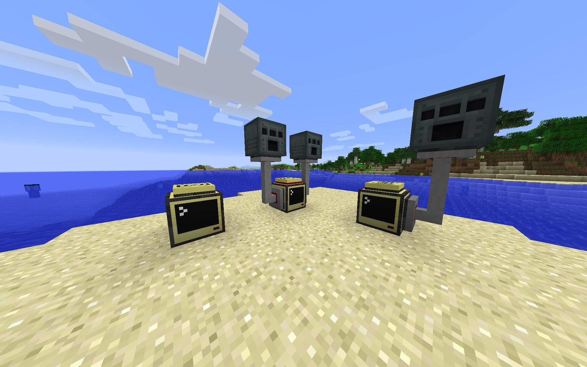

# CC-WirelessPeripheral
An implementation of the Computer Craft peripheral API allowing the use of wireless modems

The idea was to allow a wireless modem to act exactly like when you use a wired modem connected to peripherals. So imagine this as if every peripheral on your network were directly connected to the computer using the API. The API returns the peripherals connected directly to the computer as well so this can be a drop in replacement for the real peripheral API.

Not sure if this is useful for anyone, but figuired I'd put it out there since the only one I could find online didn't work anymore. If you need any help feel free to open an issue or ask me /u/jdf2 @jdf221

[Jump to how to use it](#usage)

## Example of wiring setup
You can have any number of computers running both ends of the wpp script.

So you can have 5 computers all connected to different peripherals if you wanted. Or you can have just 1 ocmputer connected to a bunch of peripherals.

Or you can have 5 computers all accessing wireless peripherals using the api, or just 1. Doesn't matter it should all just work as if everything was all connected to the one computer accessing the api.

In fact you can have a computer both accessing the api and connected to peripherals and have those peripherals accessible over the network.



But yeah in that screenshot you can see the idea of how it works. You have computers that are soley there to provide access to peripherals, they work by just connecting them to the peripheral and popping on a wiresless modem. Then running the `listen()` method. And you have the computer that is accessing those peripherals by communicating to the computers connected to them.


## Usage

Install
```
wget https://raw.githubusercontent.com/jdf221/CC-WirelessPeripheral/main/wpp.lua wpp
```

As the computer connecting to/wanting to use the peripherals:
```lua
local wpp = require("wpp")

wpp.wireless.connect("network-name") -- Network name is used as a namespace esque thing so you can have multible different wireless peripheral systems going

-- Then just use it like the normal peripheral api:
wpp.peripheral.getNames() -- etc etc
```

As the computer that is directly connected to the peripherals with a wired modem:
```lua
local wpp = require("wpp")

wpp.wireless.listen("network-name") -- Starts a loop waiting for wpp rednet messages

-- You can also have your own while loop if needed:
wpp.wireless.host("network-name")

while true do
  local event = {os.pullEvent()}
  wpp.wireless.localEventHandler(event)
end
```

And a debug mode if needed:
```lua
wpp.wireless.setDebugMode(true)
```

## Precalling methods

Not sure if this is useful for much besides what I used it for. I used it to help convert another script to support wireless, and I was having a problem that the script was calling peripheral methods at the same time it was updating the monitor. So the monitor would flash and blink because the wireless methods had a bit of a delay in the return speed.

So I made it to where you can specify a list of methods you'll be calling later and wpp will go ahead and call them and cache their returns. So that way when your script calls one of the methods wpp can return the cached response instantly. The cache is deleted after the first time the method uses it.

```lua
-- You can prefetch via the peripheral api or the wrapped peripheral api
local reactor = wpp.peripheral.wrap("the peripheral name")
reactor.wppPrefetch({
"getEnergyProducedLastTick",
"setActive"={true}
})

wpp.wireless.prefetch("the peripheral name", {
"getEnergyProducedLastTick",
"setActive"={true}
})
```

Notice you can pass arguments to the methods if needed. You can pass as many needed, just put them all in a table. Honestly I haven't tested that argument thing so uh hope it works?
